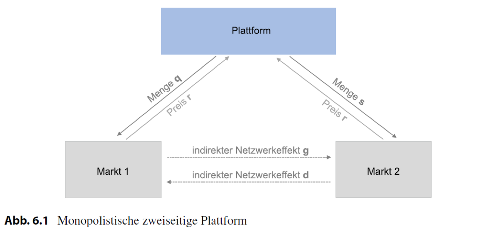

```{r include=FALSE}
library(ggplot2)
library(dplyr)
library(patchwork)
library(shiny)
library(htmlwidgets)

library(RColorBrewer)

col <- brewer.pal(6, "Set1")

```

## Aufgabe 1: Monopolist: direkte Netzerkeffekte

Die Nutzen- und Nachfragefunktion eines monopolsitischen Anbieters von Festnetztelefonie hat folgende Form: 

$$
\begin{aligned}
 U^x=
 \begin{cases}
  n(1-x)-p & \text{bei Anschluss} \\
  0 & \text{ohne Anschluss}
 \end{cases}
\end{aligned}
$$

\begin{enumerate}
  \item Was versteht man unter direkten Netzwerkeffekten. Warum liegen diese hier vor? 
  \item Bestimmen Sie den indifferenten Konsumenten und skizzieren Sie die Nachfragekurve.
Erklären und zeigen Sie, dass es mehrere Gleichgewichte gibt.
  \item Bestimmen Sie die Menge, den Preis und den Gewinn des Monopolisten.
  \item Interpretieren Sie die Ergebnisse.
\end{enumerate}

----------------------------------------------------------------

(2) Bestimmen Sie den indifferenten Konsumenten und skizzieren Sie die Nachfragekurve. Erklären und zeigen Sie, dass es mehrere Gleichgewichte gibt.

**Nutzen bei Konsum**: $U^x= n(1-x)-p$

**Indifferenter Konsument**: $(1-\bar{x})\bar{x}-p=0$


\begin{minipage}{0.5\textwidth}
Nachfrage: $p=(1-\bar{x})\bar{x}$
\end{minipage}
\begin{minipage}{0.5\textwidth}
\includegraphics[scale=0.25]{figs/uebung2-1.png}
\end{minipage}

--------------------------------------------------------------

(3) Bestimmen Sie die Menge, den Preis und den Gewinn des Monopolisten.

\begin{minipage}{0.5\textwidth}
Gewinn: $\pi=(1-x)x^2$
\end{minipage}
\begin{minipage}{0.5\textwidth}
\includegraphics[scale=0.3]{figs/uebung2-2.png}
\end{minipage}

$\frac{\delta \pi}{\delta x}=2(1-x)x-2x^2 \overset{!}=0$

$x=\lbrace 0,\frac{2}{3} \rbrace$, $p=\lbrace 0,\frac{2}{9} \rbrace$, $\pi=\lbrace 0,\frac{4}{27} \rbrace$

## Aufgabe 2: Monopolistische Plattform I

Ein Zeitungsmonopolist bedient die beiden Kundengruppen ‚Leser‘ und ‚Anzeigenkunden‘. $q$ sei die
Menge an verkauften Zeitungen und $p$ der Preis pro Zeitung. $s$ sei die Menge der verkauften Anzeigen
zum Preis $r$. Die variablen Kosten des Monopolisten sind $c1 = c2 = c$. Die Fixkosten betragen 0. Die
inversen Nachfragen nach $q$ bzw. $s$ lauten:

\begin{center}
$p=1-q-0.2s$ und $r=1-s+1.2q$
\end{center}

\begin{enumerate}
  \item Interpretieren Sie die angegebenen Nachfragefunktionen mit grafischer Hilfe.
  \item Stellen Sie die Gewinnfunktion des monopolistischen Anbieters auf.
  \item Bestimmen Sie die optimalen Mengen als Reaktion auf die jeweils andere Marktgröße.
  \item Berechnen Sie die optimalen Preise $p, r$ und Mengen $q, s$
\end{enumerate}


## Aufgabe 2.1: Monopolistische Plattform I

1. Interpretieren Sie die angegebenen Nachfragefunktionen mit grafischer Hilfe.

\begin{center}
$p=1-q-0.2s$ und $r=1-s+1.2q$
\end{center}



-----------------------------------------------------------------------------------------

```{r include=FALSE}
### Define Functions
# Base Market 1
base1 <- function(q){
  1-q
}

# Base Market 2
base2 <- function(s){
  1-s
}

### Simulate Data
x1 <- c()
x2 <- c()
count <- 1

for (i in seq(-5,5,0.01)) {
  x1[count] <- base1(i)
  x2[count] <- base2(i)
  count <- count + 1
}

### Create Dataframe
df <- data.frame(q_base= seq(-5,5,0.01),
                 s_base= seq(-5,5,0.01),
                 p_base = x1,
                 r_base = x2)
```

```{r include=FALSE}
# Define network effects
d <- -0.2
g <- 1.2

df <- df %>% mutate(p = p_base,
                    q = q_base + d,
                    r = r_base,
                    s = s_base + g,
                    ge = (q_base+(d+g))/2)

```

```{r echo=FALSE, fig.height=7, fig.width=5, message=FALSE, warning=FALSE, fig.align="center"}
ggplot(data=df, aes(q,p)) + 
  geom_line() +
  
  geom_line(data=df, aes(s,r)) +
  
  geom_line(data=df, aes(ge,p),
            linetype = 2) +
  
  geom_hline(yintercept = 0, color="grey") +
  
  scale_x_continuous(expand = c(0, 0),
                     limits = c(-0.5,3)) +
  scale_y_continuous(expand = c(0, 0),
                     limits = c(-0.5,3)) +
  annotate("text",0.1, 1, label = "Markt 1",
           color=col[4]) +
  annotate("text",1.5, 1, label = "Markt 2",
           color=col[4]) +
  labs(title= "",x="Mengen (q,s)",y="Preise (p,r)") +
  theme(text = element_text(size=14))
```

\begin{center}
\href{https://localize.shinyapps.io/vl5_app/}{\textcolor{blue}{\textbf{Zur Simulation}}}
\end{center}

## Aufgabe 2.2: Monopolistische Plattform I

2. Stellen Sie die Gewinnfunktion des monopolistischen Anbieters auf.

Inverse Nachfragefunktionen:
\begin{center}
$p=1-q-0.2s$ und $r=1-s+1.2q$
\end{center}

Kostenfunktion:
\begin{center}
$K(q,s)=c_1q+c_2s+F$ mit $c_1=c_2=c$
\end{center}

Gewinnfunktion:
\begin{center}
$\pi=(p-c)q+(r-c)s+F$
$\pi=(1-q-0.2s-c)q+(1-s+1.2q-c)s+F$
\end{center}

## Aufgabe 2.3: Monopolistische Plattform I

3. Bestimmen Sie die optimalen Mengen als Reaktion auf die jeweils andere Marktgröße.

\begin{center}
$\frac{\delta \pi}{\delta q}=1-2q-0.2s-c+1.2s \overset{!}= 0 $

$\frac{\delta \pi}{\delta s}=-0.2q+1-2s+1.2q-c \overset{!}= 0$
\end{center}

Nach $q$ bzw. $s$ umstellen:

\begin{center}
$q = \frac{1-c}{2}+\frac{1}{2}s$

$s = \frac{1-c}{2}+\frac{1}{2}q$
\end{center}

\begin{tiny}
  \begin{itemize}
  \item Können als "quasi-Reaktionsfunktionen" gesehen werden (analog zu Reaktionsfunktionen in Oligopolmärkten.)
  \item Wie verändern sich die Mengen auf am Markt als Reaktion auf Veränderungen auf dem jeweils ggü.-liegenden Markt?
  \item Solange die $d+g>1$ ist, beeinflussen sich die Mengen positiv. 
  \end{itemize}
\end{tiny}

## Aufgabe 2.4: Monopolistische Plattform II

4. Stellen Sie die optimalen Preise $p, r$ grafisch dar.

```{r echo=FALSE, fig.height=7, fig.width=5, message=FALSE, warning=FALSE, fig.align="center"}
ggplot(data=df, aes(q,p)) + 
  geom_line() +
  
  geom_line(data=df, aes(s,r)) +
  
  geom_line(data=df, aes(ge,p),
            linetype = 2) +
  
  geom_hline(yintercept = 0, color="grey") +
  
  geom_hline(yintercept = -0.2, linetype=2, 
             color = "grey") +
  geom_hline(yintercept = 1.2, linetype = 2, 
             color = "grey") +
  
  scale_x_continuous(expand = c(0, 0),
                     limits = c(-0.5,3)) +
  scale_y_continuous(expand = c(0, 0),
                     limits = c(-0.5,3)) +
  annotate("text",0.1, 1, label = "Markt 1",
           color=col[4]) +
  annotate("text",1.5, 1, label = "Markt 2",
           color=col[4]) +
  labs(title= "",x="Mengen (q,s)",y="Preise (p,r)") +
  theme(text = element_text(size=14))
```

## Aufgabe 2.5: Monopolistische Plattform II

5. Berechnen Sie die optimalen Preise $p, r$ und Mengen $q, s$

\begin{center}
$q = \frac{1-c}{2}+\frac{1}{2}s$  (1)

$s = \frac{1-c}{2}+\frac{1}{2}q$  (2)
\end{center}

$q$ in $s$ einsetzen:

\begin{center}
$q^* = 1-c$ 

$s^* = 1-c$  
\end{center}

$q^*$ und $s^*$ in inverse Nachfragefunktionen einsetzen:

\begin{center}
$p^*=1-(1-c)-0.2(1-c) = -0.2+1.2c$ 

$r^*=1-(1-c)+1.2(1-c) = 1.2-0.2c$
\end{center}

## Aufgabe 3: Monopolistische Plattform II

1. Berechnen Sie die Konsumentenrente und die Produzentenrente für $c=0$

```{r echo=FALSE, fig.align="center", message=FALSE, warning=FALSE}
p1 <- ggplot(data=df, aes(q,p)) + 
  geom_line() +
  
  geom_line(data=df, aes(ge,p),
            linetype = 2) +
  
  geom_hline(yintercept = 0, color="grey") +
  geom_hline(yintercept = -0.2, linetype=2, 
             color = col[1]) +
  scale_x_continuous(expand = c(0, 0),
                     limits = c(-0.5,3)) +
  scale_y_continuous(expand = c(0, 0),
                     limits = c(-0.5,3)) +
  labs(y="Preise (q,s)") +
  theme(text = element_text(size=10))

p2 <- ggplot(data=df, aes(s,r)) + 
  geom_line() +
  
  geom_line(data=df, aes(ge,p),
            linetype = 2) +
  
  geom_hline(yintercept = 0, color="grey") +
  geom_hline(yintercept = 1.2, linetype = 2, 
             color = col[1]) +
  scale_x_continuous(expand = c(0, 0),
                     limits = c(-0.5,3)) +
  scale_y_continuous(expand = c(0, 0),
                     limits = c(-0.5,3)) +
  
  labs(y="") +
  theme(text = element_text(size=10),
        axis.text.y = element_blank(),
        axis.ticks.y = element_blank())

p1+p2
```

## Aufgabe 3.1: Monopolistische Plattform II

1. Berechnen Sie die Konsumentenrente und die Produzentenrente.


$$
W=KR_1 + KR_2 + PR_1 + PR_2
$$
\begin{center}
$KR_1 = \frac{1}{2}(1-0.2s^*-p)q^*$ und $KR_2 = \frac{1}{2}(1+1.2q^*-r^*)s^*$
\end{center}

\begin{center}
$PR_1 = p^*q^*$ und $PR_2 = r^*s^*$
\end{center}

