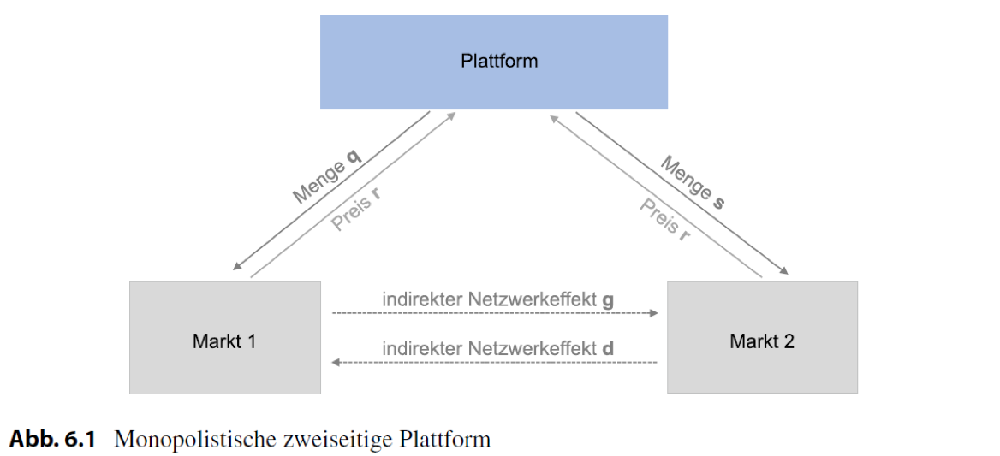

```{r include=FALSE}
library(ggplot2)
library(dplyr)
library(patchwork)

library(RColorBrewer)

col <- brewer.pal(6, "Set1")

```

## Aufgabe 1: Duopole auf Plattform-Märkten

Betrachten Sie den folgenden zweiseitigen Markt mit zwei Unternehmen ($i=1,2$). Die inversen Nachfragefunktionen für die beiden Unternehmen lauten:

**Markt 1**

\begin{center}
$p_1=1-q_1-q_2+ds_1$ und $p_2=1-q_1-q_2+ds_2$
\end{center}

**Markt 2**

\begin{center}
$r_1=1-s_1-s_2+gq_1$ und $r_2=1-s_1-s_2+gq_2$
\end{center}

wobei $p_1, p_2$ der Preis und $q_1, q_2$ die Ausbringungsmenge auf Markt 1 von Unternehmen 1 bzw. Unternehmen 2 seien. Gleiches gilt für die Preise $r_1, r_2$ und Mengen $s_1, s_2$ auf Markt 2.

---------------------------------------------------------------

**a) Interpretieren Sie die Nachfragefunktionen.**

\begin{minipage}{.4\textwidth}
  Markt 1: $p_i=1-Q+ds_i$
  
  mit $Q=\sum^n_{i=1}q_i$
  
  \noindent\rule{2cm}{0.4pt}
  
  Markt 2: $r_i=1-S+gq_i$
  
  mit: $S=\sum^n_{i=1}s_i$

\end{minipage}
\begin{minipage}{.6\textwidth}
  \includegraphics[width=\textwidth]{figs/uebung5-1.png}
\end{minipage}

------------------------------------------------------------------

**b) Stellen Sie die Gewinnfunktion auf und leiten Sie diese nach $q_1, q_2, s_1, s_2$ ab.**

Plattform 1:

$$
\max_{q_1,s_1} \pi_1 = (1-q_1-q_2+ds_1)q_1+(1-s_1+s_2+gq_1)s_1
$$

Plattform 2:

$$
\max_{q_2,s_2} \pi_2 = (1-q_1-q_2+ds_2)q_2+(1-s_1+s_2+gq_2)s_2
$$

------------------------------------------------------------------

**b) Stellen Sie die Gewinnfunktion auf und leiten Sie diese nach $q_1, q_2, s_1, s_2$ ab.**

Plattform 1:

$$
\pi_1 = (1-q_1-q_2+ds_1)q_1+(1-s_1+s_2+gq_1)s_1
$$

\begin{center}
  $\frac{\delta \pi_1}{\delta q_1}=1-2q_1-q_2+ds_1+gs_1 \overset{!}= 0$
  
  $\frac{\delta \pi_1}{\delta s_1}=dq_1+1-2s_1-s_2+gq_1 \overset{!}= 0$
\end{center}

-------------------------------------------------------------------

**...Interpretieren Sie die Reaktionsfunktionen von Markt 1 anhand einer geeigneten Grafik.**

```{r include=FALSE}
# Define Function
q1 <- function(q2){
  1-((1/2)*q2)
}

q2 <- function(q1){
  1-((1/2)*q1)
}

# Simulate Data
x <- c()
y <- c()
count <- 1

for (i in seq(-10,10,0.01)) {
  x[count] <- q1(i)
  y[count] <- q2(i)
  count <- count + 1
}

# Create Dataframes
# q1
df1 <- data.frame(q2 = seq(-10,10,0.01),
                 q1 = x)

# q2
df2 <- data.frame(q1 = seq(-10,10,0.01),
                 q2 = y)

p1 <- ggplot(df1, aes(q1,q2)) + geom_line(color=col[1]) +
  geom_line(data=df2,aes(q1,q2), color=col[1]) +
  scale_x_continuous(expand = c(0, 0), 
                     limits = c(0,2.2),
                     breaks = c(0,1,2),
                     labels = c(0, expression(paste(frac("1","2")," - ",
                                                    frac("1","2"),q[1], " + ",frac("(d+g)s2","2"))), 
                                expression(paste(frac("1","2")," + ",frac("(d+g)s1","2"))))) +

  scale_y_continuous(expand = c(0, 0), 
                     limits = c(0,2.2),
                     breaks = c(0,1,2), 
                     labels = c(0, expression(paste(frac("1","2")," - ",
                                                    frac("1","2"),q[2], " + ",frac("(d+g)s1","2"))),
                                expression(paste(frac("1","2")," + ",frac("(d+g)s2","2"))))) +
  # Add line labels
  annotate("text",0.2, 0.8, parse=TRUE, label = as.character(expression("q"[1]))) +
  annotate("text",0.8, 0.2, parse=TRUE, label = as.character(expression("q"[2]))) +
  labs(x=expression("q"[1]), y=expression("q"[2]), 
       title="") +
  theme(axis.text = element_text(size = 7))

ggsave(plot = p1, filename = "figs/uebung5-2.png",
       width = 4, height = 4.5)
```

\begin{minipage}{.4\textwidth}

\textbf{Markt 1:}

  $q_1=\frac{1}{2}-\frac{1}{2}q_2+\frac{(d+g)}{2}s_1$
  
\textbf{Markt 2:}

  $s_1=\frac{1}{2}-\frac{1}{2}s_2+\frac{(d+g)}{2}q_1$

\end{minipage}
\begin{minipage}{.6\textwidth}
  \includegraphics[width=\textwidth]{figs/uebung5-2.png}
\end{minipage}

--------------------------------------------------------------------

**c. Berechnen Sie die Mengen der Unternehmen...**

* Plattformen sind symmetrisch, d.h. im Gleichgewicht müssen die Mengen gleich sein. Somit gilt: $q=q_1=q_2$ und $s=s_1=s_2$

\begin{center}
$q=\frac{1-q}{2}+\frac{(d+g)}{2}s$ und $s=\frac{1-s}{2}+\frac{(d+g)}{2}q$
\end{center}

nach $q$, bzw. $s$ umstellen:

\begin{center}
$q=\frac{1}{3}+\frac{d+g}{3}s$ und $s=\frac{1}{3}+\frac{d+g}{3}q $
\end{center}

$s$ in $q$ einsetzen:

\begin{center}
$q=\frac{1}{3-(d+g)}$ und $s=\frac{1}{3-(d+g)}$
\end{center}

-------------------------------------------------------------------

**...die Gesamtmenge für jeden Markt ($Q$ und $S$).**

$$
Q= q_1+q_2=\frac{2}{3-(d+g)}
$$

$$
S= s_1+s_2=\frac{2}{3-(d+g)}
$$

--------------------------------------------------------------------

**...und die Preise.**

**Markt 1**

\begin{center}
$p=1-\frac{2}{3-(d+g)}+d\frac{1}{3-(d+g)}$ 

$p=\frac{1-g}{3-(d+g)}$ 
\end{center}

* Der Netzwerkeffekt, der von Markt 1 ausgeht (g) senkt den Preis auf diesem Markt

* Die Summe der Netzwerkeffekte lassen den Preis steigen (Markterweiterungseffekt)

**Markt 2**

\begin{center}
$r=\frac{1-d}{3-(d+g)}$
\end{center}

--------------------------------------------------------------------

**Gewinn (Duopol)**
$$
\pi_i=q_i*p+s_i*r
$$

$$
\pi_i=\frac{2-(d+g)}{(3-(d+g))^2}
$$

--------------------------------------------------------------------

d) Nehmen Sie nun an, dass beide Unternehmen zu einem Monopolisten fusionieren. Berechnen Sie den Gewinn des Monopolisten.

Inverse Nachfragefunktionen:
\begin{center}
$p=1-q+ds$ und $r=1-s+dq$
\end{center}

Gewinn:
\begin{center}
$\max_{q,s} \pi = (1-q+ds)q+(1-s+gq)s$ 
\end{center}

Mengen:
\begin{center}
$q^*_M=s^*_M=\frac{1}{2-(d+g)}$ < $Q^*_D=S^*_D=\frac{2}{3-(d+g)}$, für $(d+g)<1$
\end{center}

Preise:
\begin{center}
$p^*_M=\frac{1-g}{2-(d+g)}$ und $r^*_M=\frac{1-d}{2-(d+g)}$
\end{center}

-------------------------------------------------------------------

**Gewinn**
\begin{center}
$\pi_M=\frac{1}{2-(d+g)} > \pi_D=\frac{2-(d+g)}{(3-(d+g))^2}$ 
\end{center}

* Wettbewerbseffekt (ähnlich dem gewöhnlichen Cournot- Ergebnis): 
  
    * Die Mengen jeder Firma sinken im Wettbewerb im Vergleich zur Monopolmenge, insgesamt wird aber eine größere Menge ausgebracht. 
    * Dadurch ergibt sich ein geringerer Marktpreis und auch die Gewinne der Unternehmen sinken. 
    * Für Unternehmen wäre ein Monopol besser, Konsumenten profitieren dagegen von der größeren Menge und dementsprechend niedrigeren Preisen.
  
* Netzwerkeffekt: 

    * Jede Plattform bedient eine kleinere Menge; dadurch wird der Netzeffekt nicht mehr optimal ausgenutzt. 
    * Bei Markteintritt steht dem für die Konsumenten immer positive Wettbewerbseffekt, der immer negative Netzeffekt entgegen.
  
-----------------------------------------------------------------

**e) Setzen Sie folgende Werte für d und g ein und vergleichen Sie die Ergebnisse zwischen Duopol und Monopol.**

```{r include=FALSE}
### Mengen ###
qM <- function(d,g){1/(2-(d+g))} 
qD <- function(d,g){1/(3-(d+g))}

### Preise ##
pM <- function(d,g){(1-g)/(2-(d+g))}
rM <- function(d,g){(1-d)/(2-(d+g))}
  
pD <- function(d,g){(1-d)/(3-(d+g))}
rD <- function(d,g){(1-g)/(3-(d+g))}

### Gewinn ###
piM <- function(d,g){1/(2-(d+g))}
piD <- function(d,g){(2-(d+g))/(3-(d+g))}
```

* a) d = -0.2, g=1.2

```{r echo=FALSE, message=FALSE, warning=FALSE}
d <- -0.2
g <- 1.2

cat(paste("Monopol:\n", 
            "Mengen: q=s=",qM(d,g) ,"\n",
            "Preise:","p=",pM(d,g),"r=",rM(d,g),"\n",
            "Gewinn:", piM(d,g), "\n"))

cat(paste("Duopol:\n", 
            "Mengen: q=s=",qD(d,g),"\n",
            "Preise:","p=",pD(d,g),"r=",rD(d,g),"\n",
            "Gewinn:", piD(d,g)))
```

-----------------------------------------------------------------

* b) d = 0.2, g = 1.2

```{r echo=FALSE, message=FALSE, warning=FALSE}
d <- 0.2
g <- 1.2

cat(paste("Monopol:\n", 
            "Mengen: q=s=",round(qM(d,g),2) ,"\n",
            "Preise:","p=",round(pM(d,g),2),"r=",round(rM(d,g),2),"\n",
            "Gewinn:", round(piM(d,g),2), "\n"))

cat(paste("Duopol:\n", 
            "Mengen: q=s=",qD(d,g),"\n",
            "Preise:","p=",pD(d,g),"r=",rD(d,g),"\n",
            "Gewinn:", piD(d,g)))
```

------------------------------------------------------------------

* c) d = 0.1, g = 0.2
```{r echo=FALSE, message=FALSE, warning=FALSE}
d <- 0.1
g <- 0.2

cat(paste("Monopol:\n", 
            "Mengen: q=s=",round(qM(d,g),2) ,"\n",
            "Preise:","p=",round(pM(d,g),2),"r=",round(rM(d,g),2),"\n",
            "Gewinn:", round(piM(d,g),2), "\n"))

cat(paste("Duopol:\n", 
            "Mengen: q=s=",round(qD(d,g),2),"\n",
            "Preise:","p=",round(pD(d,g),2),"r=",round(rD(d,g),2),"\n",
            "Gewinn:", round(piD(d,g),2)))
```

## Aufgabe 2: Monopolistische Plattform 

Eine monopolistische zweiseitige Plattform hat folgende indirekte Nachfragefunktionen:

\begin{center}
$p=100-q-ds$ und $r=100-s+gq$
\end{center}

und die Kostenfunktion: $K(q,s) = cq+cs$

Wobei $q$ und $s$ die Mengen und $p$ und $r$ die Preise auf den jeweiligen Märkten sind.

-----------------------------------------------------------------------------

\begin{center}
$p=100-q-ds$ und $r=100-s+gq$
\end{center}




-----------------------------------------------------------------------------

Stellen Sie die Gewinnfunktion auf berechnen Sie die optimalen Mengen $q$ und $s$ auf den beiden Märkten.

Gewinnfunktion:
\begin{center}
$\pi=(p-c)q+(r-c)s+F$

$\pi=(100-q-ds-c)q+(1-s+gq-c)s$
\end{center}

\begin{center}
$\frac{\delta \pi}{\delta q}=100-2q-ds-c+gs \overset{!}= 0 $

$\frac{\delta \pi}{\delta s}=-dq+100-2s+gq-c \overset{!}= 0$
\end{center}


---------------------------------------------------------------------------

Stellen Sie die Gewinnfunktion auf berechnen Sie die optimalen Mengen $q$ und $s$ auf den beiden Märkten. Interpretieren Sie den Einfluss der Parameter $d$ und $g$.

Nach $q$ bzw. $s$ umstellen:

\begin{center}
$q = \frac{100-c}{2}+\frac{g-d}{2}s$
$s = \frac{100-c}{2}+\frac{g-d}{2}q$
\end{center}

$s$ in $q$ einsetzen ergibt:
 
\begin{center}
$q^* = \frac{100-c}{2-(g-d)} = s^*$ 
\end{center}

----------------------------------------------------------------------------

\begin{center}
$q^* = \frac{100-c}{2-(g-d)}$ 
\end{center}

```{r echo=FALSE, fig.align="center", fig.height=4, fig.width=6, message=FALSE, warning=FALSE}
d <- 0.2

mengen <- function(g){
  100/(2-((-d)+g))
  }

x <- c()
count <- 1

for (i in seq(-2,2,0.01)) {
  x[count] <- mengen(i)
  count <- count + 1
}

### Create Dataframe
df <- data.frame(g = seq(-2,2,0.01),
                 q = x,
                 s = x,
                 d = -0.2)

ggplot(data=df, aes(g,q)) + 
  geom_line() + 
  scale_x_continuous(expand = c(0, 0),
                      limits = c(-1,2),
                     breaks = c(0,0.2,1,2)) +
  geom_hline(yintercept = 50, color=col[1],
             linetype = 2, size = 0.3) +
  geom_vline(xintercept = 0.2, linetype = 2,
             color = col[1], size = 0.3) +
  labs(title= "Optimale Mengen für d=0.2",x="g",y="Mengen (q,s)") 
```

## Aufgabe 1 b)

Berechnen Sie die optimalen Preise $p$ und $r$ auf den beiden Märkten. 

$q^*$ und $s^*$ in inverse Nachfragefunktionen einsetzen:

\begin{center}
$p^*=100-(\frac{100-c}{2-(g-d)})-d(\frac{100-c}{2-(g-d)}) = \frac{100-100g+dc+c}{2-(g-d)}$ 

$r^*=100-(\frac{100-c}{2-(g-d)})+g(\frac{100-c}{2-(g-d)}) = \frac{100-100d-gc+c}{2-(g-d)}$
\end{center}

---------------------------------------------------------------------------------------

Stellen Sie den Preis $p$ als Preiskostenaufschlag dar. Wann liegt der Preis $p$ unterhalb der Grenzkosten?

$p^*$ mit c erweitern: $p^*= \frac{(100-c)(1-g)}{2-(g-d)}$ 

```{r echo=FALSE, fig.align="center", fig.height=4, fig.width=8, message=FALSE, warning=FALSE}
d <- 0.2
c <- 0

preise <- function(g){
  c+((100-c)*(1-g))/(2-((-d)+g))
  }

x <- c()
count <- 1

for (i in seq(-2,2,0.01)) {
  x[count] <- preise(i)
  count <- count + 1
}

### Create Dataframe
df <- data.frame(g = seq(-2,2,0.01),
                 p = x)

p1 <- ggplot(data=df, aes(g,p)) + 
  geom_line() +
  geom_hline(yintercept = c,
             linetype = 2) +
  geom_vline(xintercept = 1, linetype = 2,
             color = col[1]) +
  scale_x_continuous(expand = c(0, 0),
                      limits = c(0,1.5)) +
    scale_y_continuous(expand = c(0, 0),
                      limits = c(-100,100)) +
  labs(title= paste("c =",c),x="g (d=0.2)",y="p") 

#---------- c = 40 ----------#
c <- 40

x <- c()
count <- 1

for (i in seq(-2,2,0.01)) {
  x[count] <- preise(i)
  count <- count + 1
}

### Create Dataframe
df <- data.frame(g = seq(-2,2,0.01),
                 p = x)

p2 <- ggplot(data=df, aes(g,p)) + 
  geom_line() +
  geom_hline(yintercept = c,
             linetype = 2) +
    geom_vline(xintercept = 1, linetype = 2,
             color = col[1]) +
  scale_x_continuous(expand = c(0, 0),
                      limits = c(0,1.5)) +
    scale_y_continuous(expand = c(0, 0),
                      limits = c(-100,100)) +
  labs(title= paste("c =",c),x="g (d=0.2)") +
  theme(axis.text.y = element_blank(),
        axis.ticks.y = element_blank(),
        axis.title.y = element_blank())

#---------- c = 90 ----------#
c <- 90

x <- c()
count <- 1

for (i in seq(-2,2,0.01)) {
  x[count] <- preise(i)
  count <- count + 1
}

### Create Dataframe
df <- data.frame(g = seq(-2,2,0.01),
                 p = x)

p3 <- ggplot(data=df, aes(g,p)) + 
  geom_line() +
  geom_hline(yintercept = c,
             linetype = 2) +
    geom_vline(xintercept = 1, linetype = 2,
             color = col[1]) +
  scale_x_continuous(expand = c(0, 0),
                      limits = c(0,1.5)) +
    scale_y_continuous(expand = c(0, 0),
                      limits = c(-100,100)) +
  labs(title= paste("c =",c),x="g (d=0.2)",y="p") +
    theme(axis.text.y = element_blank(),
        axis.ticks.y = element_blank(),
        axis.title.y = element_blank())

p1 + p2 + p3
```

--------------------------------------------------------------------------

**Ist das ein Problem aus wettbewerbsökonomischer Sicht?**

* Wenn $p \neq c$ dann geht man in der Theorie davon aus, dass der Markt sich nicht im Optimum befindet. 

    * Bei $p > c$: Monopolmärkte
    * Bei $p < c$: Predatory pricing, Verdrängungswettbewerb (Beispiel Lufthansa / Air Berlin)

* Wenn indirekte Netzwerkeffekte vorliegen kann es aber optimal sein (bzw. die Konsumentenrente maximiert sein), wenn auf einer Marktseite ein Preis unterhalt den Grenzkosten vorliegt da nur so die IDE optimal ausgenutzt werden können. 

--------------------------------------------------------------------------

Nehmen Sie an, dass $d=0.2$ und $g=1$. Nennen Sie ein Praxisbeispiel für einen solchen Fall. Wie hoch sind die Preise? 

\begin{center}
$p=100-q-0.2s$ und $r=100-s+q$
\end{center}

**Mengen**

\begin{center}
$q^* = \frac{100-c}{2-(g-d)} = \frac{100-c}{1.2}$

$s^* = \frac{100-c}{2-(g-d)} = \frac{100-c}{1.2}$
\end{center}

**Preise**
\begin{center}
$p^*= \frac{100-100g+dc+c}{2-(g-d)} = 1c$ 

$r^* = \frac{100-100d-gc+c}{2-(g-d)} = 100$
\end{center}


--------------------------------------------------------------------------

Was ändert sich, wenn $d$ auf $0.2$ ansteigt? Interpretieren Sie vor allem die Auswirkungen auf den Preis $p$.

\begin{center}
$p=100-q+0.2s$ und $r=100-s+q$
\end{center}

**Mengen**

\begin{center}
$q^* = \frac{100-c}{2-(g-d)} = \frac{100-c}{0.8}$

$s^* = \frac{100-c}{2-(g-d)} = \frac{100-c}{0.8}$
\end{center}

**Preise**
\begin{center}
$p^*= \frac{100-100g+dc+c}{2-(g-d)} = 1c$ 

$r^* = \frac{100-100d-gc+c}{2-(g-d)} = 100$
\end{center}

