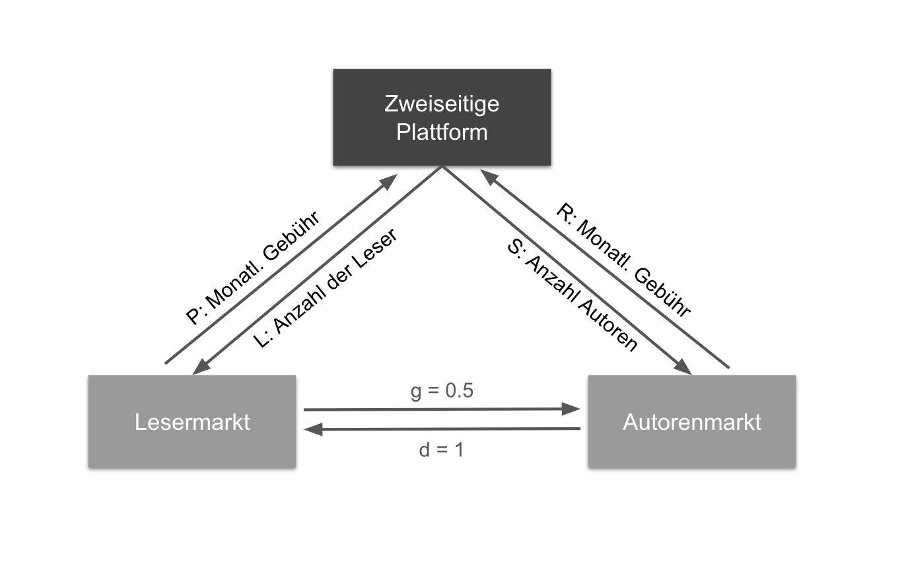

```{r include=FALSE}
library(ggplot2)
library(dplyr)
library(patchwork)
library(htmlwidgets)

library(RColorBrewer)

col <- rcartocolor::carto_pal(6, "Bold")
```

## Aufgabe 1: Monopolistische Plattform

Eine monopolistische Plattform, auf der Autoren den Lesern ihre Romane online anbieten können, verlangt jeweils eine monatliche Gebühr für das Einstellen und das Lesen der Romane. L sei die Zahl an Lesern und A sei die Menge an Autoren. Gehen Sie davon aus, dass jeder Autor nur einen Roman im Monat einstellt und jeder Leser nur einen Roman pro Monat konsumiert. Die monatliche Gebühr für die Leser sei P, die Gebühr für die Autoren beträgt R Euro. Die inversen Nachfragen nach L bzw. A lauten:

**Lesermarkt:** $P=1-L+dA$

**Autorenmarkt:** $R=1-A+gL$

mit $d=1$ und $g=0.5$.

Die Kostenfunktion der Plattform ist durch variable Kosten für die Herstellung der Produkte beider Märkte $c1=c2=0$ und durch fixe Kosten in Höhe von $F=2$ gegeben.

---------------------------------------------------------------

a) Interpretieren Sie die angegebenen Nachfragefunktionen (ggf. anhand einer Abbildung). Gehen Sie dabei auf den Einfluss der indirekten Netzeffekte ein. Wie wirkt sich die Zweiseitigkeit der Märkte auf die Nachfragefunktionen aus?



---------------------------------------------------------------

```{r include=FALSE}
### Define Functions
# Base Market 1
base1 <- function(q){1-q}

# Base Market 2
base2 <- function(s){1-s}

### Simulate Data
x1 <- c()
x2 <- c()
count <- 1

for (i in seq(-2,2,0.01)) {
  x1[count] <- base1(i)
  x2[count] <- base2(i)
  count <- count + 1
}

### Create Dataframe
df <- data.frame(q_base= seq(-2,2,0.01),
                 s_base= seq(-2,2,0.01),
                 p_base = x1,
                 r_base = x2)

# Define network effects
d <- 1
g <- 0.5

df <- df %>% mutate(p = p_base+d,
                    q = q_base+d,
                    r = r_base+g,
                    s = s_base+g,
                    ge1 = q_base+(q*(d+g)),
                    ge2 = ge1/2)

```

```{r echo=FALSE, message=FALSE, warning=FALSE, fig.height=6, fig.width=5, fig.align="center"}
ggplot(data=df, aes(q_base,p_base)) +
  # base market
  geom_line(linetype = 2) +
  # Lesermarkt
  geom_line(aes(q,p), color = "red") +
  annotate("text",1.5, 2, label = "Lesermarkt", color= "red") +
  # Autorenmart
  geom_line(data=df, aes(s,r), color = "blue") +
  annotate("text",0.5, 2, label = "Autorenmarkt", color="blue") +

  scale_x_continuous(expand = c(0, 0), limits = c(0,3.3), 
                     breaks = c(1,2,3), labels = c("1","1+gL","1+dA")) +
  scale_y_continuous(expand = c(0, 0), limits = c(0,3.3), 
                     breaks = c(1,2,3), labels = c("1","1+gL","1+dA")) +
  labs(title= "",x="Mengen (L,A)",y="Preise (P,R)") +
  theme(text = element_text(size=14))
```

------------------------------------------------------------------

b) Stellen Sie die Gewinnfunktion auf und berechnen Sie die Bedingungen erster Ordnung ...

$$
\max_{L, A} \pi = (1-L+A)L+(1-A+0.5L)A - 2
$$

Bedingungen erster Ordnung (FOC):

\begin{center}
  $\frac{\delta \pi}{\delta L}=1-2L+1.5A \overset{!}= 0$
  
  $\frac{\delta \pi}{\delta A}=1-2A+1.5L \overset{!}= 0$
\end{center}

------------------------------------------------------------------

...und die optimalen Mengen L und A. Interpretieren Sie den Einfluss der Parameter d und g.

\begin{center}
  $L=\frac{1}{2} + 0.75A$
  
  $A=\frac{1}{2} + 0.75L$
\end{center}

$A$ in $L$ einsetzen:

\begin{center}
$L^* = 2$ 

$A^* = 2$  
\end{center}

------------------------------------------------------------------

c) Berechnen Sie die optimalen Preise P und R. Interpretieren Sie die Preise. Liegt hier ein Wettbewerbsproblem vor?

$L^*$ und $A^*$ in inverse Nachfragefunktionen einsetzen:

\begin{center}
$P^*=1-2+2 = 1$ 

$R^*=1-2+0.5*2 = 0$
\end{center}

- Der Autorenmarkt hat einen stärkeren Effekt auf den Lesermarkt (d > g), deshalb zahlen die Autoren einen geringeren Preis (R < P). Der Autorenmarkt wird also subventioniert durch einen höheren Preis auf dem Lesermarkt. 


------------------------------------------------------------------

d) Zeigen Sie die optimalen Mengen und Preise in einer geeigneten Grafik.

```{r echo=FALSE, message=FALSE, warning=FALSE, fig.height=6, fig.width=5, fig.align="center"}
ggplot(data=df, aes(q,p)) + 
  # Lesermarkt
  geom_line(color = "red") +
  annotate("text",1.5, 2, label = "Lesermarkt", color= "red") +
  geom_segment(aes(x=0,xend=2,y=1,yend=1),colour="red", linetype = 2) +
  # Autorenmart
  geom_line(data=df, aes(s,r), color = "blue") +
  annotate("text",0.5, 2, label = "Autorenmarkt", color="blue") +
  geom_segment(aes(x=0,xend=2,y=0,yend=0),colour="blue", linetype = 2) +

  scale_x_continuous(expand = c(0, 0), limits = c(0,3.3), breaks = seq(0,3,0.5)) +
  scale_y_continuous(expand = c(0, 0), limits = c(0,3.3), breaks = seq(0,3,0.5)) +
  labs(title= "",x="Mengen (L,A)",y="Preise (P,R)") +
  theme(text = element_text(size=14))
```

## Aufgabe 2: Duopole auf Plattform-Märkten

Betrachten Sie einen zweiseitigen Markt mit zwei identischen Unternehmen ($i = 1,2$), die identische Produkte anbieten. Die Mengen werden jeweils mit $q_i$ und $s_i$, die Preise mit $p_i$ und $r_i$ gekennzeichnet. Die inversen Nachfragefunktionen lauten

**Markt 1**

\begin{center}
$p_i=1-q_1-q_2+ds_i$
\end{center}

**Markt 2**

\begin{center}
$r_i=1-s_1-s_2+gq_i$
\end{center}

Von Kosten wird abstrahiert. (keine variablen oder fixe Kosten)

---------------------------------------------------------------

a) Interpretieren Sie die Nachfragefunktionen. Welchen Einfluss haben die einzelnen Paramenter?

Markt 1: $p_i=1-Q+ds_i$, mit $Q=\sum^n_{i=1}q_i$

- $Q \uparrow$ $\rightarrow$ $p_i \downarrow$
- $s_i \uparrow$ $\rightarrow$ $p_i \uparrow$, in Abhängigkeit von $d$

Markt 2: $r_i=1-S+gq_i$, mit: $S=\sum^n_{i=1}s_i$

- $S \uparrow$ $\rightarrow$ $r_i \downarrow$
- $q_i \uparrow$ $\rightarrow$ $r_i \uparrow$, in Abhängigkeit von $g$

- Die indirekte Netwerkeffekte $d$ und $g$ haben einen Markerweiterungseffekt.

------------------------------------------------------------------

b) Stellen Sie die Gewinnfunktionen auf ...

Plattform 1:

$$
\max_{q_1,s_1} \pi_1 = (1-q_1-q_2+ds_1)q_1+(1-s_1+s_2+gq_1)s_1
$$

Plattform 2:

$$
\max_{q_2,s_2} \pi_2 = (1-q_1-q_2+ds_2)q_2+(1-s_1+s_2+gq_2)s_2
$$

------------------------------------------------------------------

... und berechnen Sie die Bedingungen erster Ordnung.

Plattform 1:

$$
\pi_1 = (1-q_1-q_2+ds_1)q_1+(1-s_1+s_2+gq_1)s_1
$$

\begin{center}
  $\frac{\delta \pi_1}{\delta q_1}=1-2q_1-q_2+ds_1+gs_1 \overset{!}= 0$
  
  $\frac{\delta \pi_1}{\delta s_1}=dq_1+1-2s_1-s_2+gq_1 \overset{!}= 0$
\end{center}

-------------------------------------------------------------------

c) Berechnen Sie die optimalen Mengen und Preise auf beiden Märkte. Interpretieren Sie die Ergebnisse. Gehen Sie dabei auf den Effekt der Netzwerkeffekte ein.

* Plattformen sind symmetrisch, d.h. im Gleichgewicht müssen die Mengen gleich sein. Somit gilt: $q=q_1=q_2$ und $s=s_1=s_2$

\begin{center}
$q=\frac{1-q}{2}+\frac{(d+g)}{2}s$ und $s=\frac{1-s}{2}+\frac{(d+g)}{2}q$
\end{center}

nach $q$, bzw. $s$ umstellen:

\begin{center}
$q=\frac{1}{3}+\frac{d+g}{3}s$ und $s=\frac{1}{3}+\frac{d+g}{3}q $
\end{center}

$s$ in $q$ einsetzen:

\begin{center}
$q=\frac{1}{3-(d+g)}$ und $s=\frac{1}{3-(d+g)}$
\end{center}

--------------------------------------------------------------------

**...und die Preise.**

**Markt 1**

\begin{center}
$p=1-\frac{2}{3-(d+g)}+d\frac{1}{3-(d+g)}$ 

$p=\frac{1-g}{3-(d+g)}$ 
\end{center}

* Der Netzwerkeffekt, der von Markt 1 ausgeht (g) senkt den Preis auf diesem Markt

* Die Summe der Netzwerkeffekte lassen den Preis steigen (Markterweiterungseffekt)

**Markt 2**

\begin{center}
$r=\frac{1-d}{3-(d+g)}$
\end{center}
