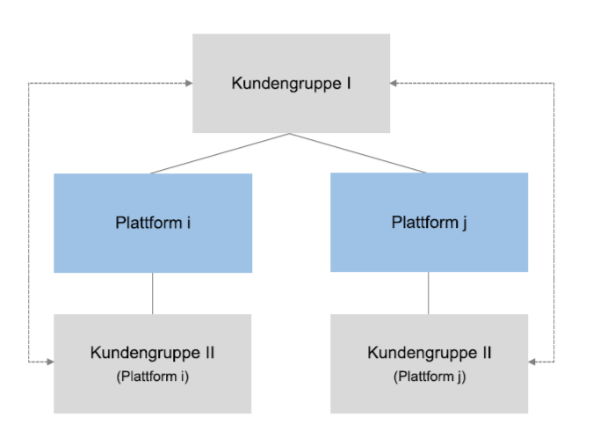

```{r include=FALSE}
library(ggplot2)
library(dplyr)
library(patchwork)
library(htmlwidgets)

library(RColorBrewer)

col <- rcartocolor::carto_pal(6, "Bold")
```

## Aufgabe 1: indirekte Netzwerkeffekte

Eine monopolistische zweiseitige Plattform hat folgende inverse Nachfragefunktionen.

**Markt 1**

\begin{center}
$p=100-q+ds$
\end{center}

**Markt 2**

\begin{center}
$r=100-s+gq$
\end{center}

mit $d<d,g<2$, wobei $q$ und $s$ die Mengen und $p$ und $r$ die Preise auf den jeweiligen Märkten sind. 

Die Kostenfunktion der Plattform ist gegeben durch: $K(q,s)=cq+cs$

---------------------------------------------------------------

**a) Erläutern Sie unter Verwendung geeigneter Abbildungen (Koordinatensystem) das einfache Monopolmodell.**

```{r include=FALSE}
### Define Functions
# Base Market 1
base1 <- function(q){
  1-q
}

# Base Market 2
base2 <- function(s){
  1-s
}

### Simulate Data
x1 <- c()
x2 <- c()
count <- 1

for (i in seq(-2,2,0.01)) {
  x1[count] <- base1(i)
  x2[count] <- base2(i)
  count <- count + 1
}

### Create Dataframe
df <- data.frame(q_base= seq(-2,2,0.01),
                 s_base= seq(-2,2,0.01),
                 p_base = x1,
                 r_base = x2)

# Define network effects
d <- 0.2
g <- 0.2

df <- df %>% mutate(p = p_base,
                    q = q_base+d,
                    r = r_base,
                    s = s_base+g)

```


```{r echo=FALSE, message=FALSE, warning=FALSE, fig.height=3, fig.width=5, fig.align="center"}
p1 <- ggplot(data=df, aes(q_base,p_base)) + 
      # base market
  geom_line(color=col[2]) +
      # q
  geom_line(data=df, aes(q,p), linetype=2,
            color=col[2]) +
  geom_line(data=df, aes(s,r), linetype = 2,
            color=col[2]) +
  scale_x_continuous(expand = c(0, 0),
                     breaks = c(1,1.2), 
                     labels = c("100","100+ds"),
                     limits = c(0,1.3)) +
  scale_y_continuous(expand = c(0, 0),
                     breaks = c(1,1.2), 
                     labels = c("100","100+ds"),
                     limits = c(0,1.3)) +
  labs(title= "Markt 1",x="",y="") +
  theme(text = element_text(size=8))

p2 <- ggplot(data=df, aes(q_base,p_base)) + 
      # base market
  geom_line(color=col[2]) +
      # q
  geom_line(data=df, aes(q,p), linetype=2,
            color=col[2]) +
  scale_x_continuous(expand = c(0, 0),
                     breaks = c(1,1.2), 
                     labels = c("100","100+gq"),
                     limits = c(0,1.3)) +
  scale_y_continuous(expand = c(0, 0),
                     breaks = c(1,1.2), 
                     labels = c("100","100+gq"),
                     limits = c(0,1.3)) +
  labs(title= "Markt 2", x="",y="") +
  theme(text = element_text(size=8))

p1 + p2

```

------------------------------------------------------------------

**b) Stellen Sie die Gewinnfunktion auf.**

$$
\pi = (1-q+ds-c)q+(1-s+gq-c)s
$$

Zeigen Sie, dass die Mengen $q=s=\frac{100-c}{2-(d+g)}$ sind.  Interpretieren Sie den Einfluss der Parameter $d$ und $g$. Warum sind die Mengen gleich?

* Die Mengen sind positiv abhängig von der Summer der Netzwerkeffekte:

  * Wenn $d+g = 0$ entpsrechen die Mengen dem Monopolfall. 
  * Wenn $d+g > 0$ kommt es zu einer Markterweiterung. Dabei reicht es auch, wenn nur einer der beiden Netzeffekte positiv ist.
  * Wenn $d+g <0$ dann wirkt sich die Verbundenheit der Märkte negativ auf die Mengen aus.
  
------------------------------------------------------------------

**b) Die Preise sind gegeben durch**

\begin{center}
$p^*=c+\frac{(100-c)(1-g)}{2-(d+g)}$ und $r^*=c+\frac{(100-c)(1-d)}{2-(d+g)}$
\end{center}

Berechnen Sie die Deckungsbeiträge auf Markt 1 und Markt 2. 

\begin{center}
$DB_1 = (p^*-c)q^*=(c+\frac{(100-c)(1-g)}{2-(d+g)}-c)\frac{100-c}{2-(d+g)}$

$DB_1 = \frac{(100-c)^2(1-g)}{(2-(d+g))^2}$

$DB_2 = \frac{(100-c)^2(1-d)}{(2-(d+g))^2}$
\end{center}

------------------------------------------------------------------

**Welchen Einfluss haben die indirekten Netzeffekte auf die Deckungsbeiträge der monopolistischen Plattform?**

\begin{center}
$DB_1 = \frac{(100-c)^2(1-g)}{(2-(d+g))^2}$

$DB_2 = \frac{(100-c)^2(1-d)}{(2-(d+g))^2}$
\end{center}

  * Die Relation der Netzwerkeffekte bestimmt die Höhe der Deckungsbeiträge. Bei stark unterschiedlichen Netzwerkeffekten, sind auch starkt unterschiedliche DB zu erwarten (analog zu den Preisen).

  * Wenn $g$ steigt (ceteris paribus)...
    
    1. ... fällt $DB_1$: Der Netzwerkeffekt, der von Markt 1 auf Markt 2 wirkt, wird stärker. Somit ist es für den Monopolisten gewinnmaximierend, Markt 1 durch geringere Preise zu subventionieren. Der DB wird geringer.
    2. ... steigt $DB_2$: Markt 2 empfängt einen stärkeren Netzwerkeffekt, der Nutzen der Konsumenten auf dieser Marktseite steigt, sie sind also bereit einen höheren Preis zu zahlen. Der DB wird höher.
    3. ... steigen $DB_1$ und $DB_2$: Markterweiterungseffekt

##Aufgabe 2: Asymmetrische Märkte

Betrachten Sie den folgenden zweiseitigen Markt mit zwei Unternehmen ($i=1,2$). Die Nachfrage auf Markt 1 für Unternehmen 1 sei gegeben durch:

\begin{center}
$p_1=1-q_1-0.3s_1$
\end{center}

Auf Markt 2 beträgt die Nachfrage bei Unternehmen 1:

\begin{center}
$r_1=1-s_1-s_2+1.2q_1$
\end{center}

wobei $p_1$ der Preis und $q_1$ die Ausbringungsmenge auf Markt 1 von Unternehmen 1 sei und $r_1$ der Preis und $s_1$ die Ausbringungsmenge auf Markt 2 von Unternehmen 1 sei. $s_2$ ist die Ausbringungsmenge von Unternehmen 2 auf Markt 2.

----------------------------------------------------------------

**a) Interpretieren Sie die Nachfragefunktionen und finden Sie ein Beispiel für eine solche Modellwelt.**



----------------------------------------------------------------

**a) Interpretieren Sie die Nachfragefunktionen und finden Sie ein Beispiel für eine solche Modellwelt.**

  * \textbf{Bisher:} Symmetrische Markt- bzw. Wettbewerbsstrukturen auf beiden Märkten. Zwei (oder mehr) Plattformen konkurrieren auf den selben Märkten um die selben Konsumentengruppen.

  * \textbf{In der Realität} ist es aber of so, dass Plattformen insbesondere auf dem Werbemarkt mit mehr Anbietern konkurrieren. Z.B. lokale Zeitungen, online Plattformen.
  
Markt 1: $p_1=1-q_1-0.3s_1$ 

  * Monopolmarkt, der einen negativen Netzwerkeffekt empfängt (z.B. Leser einer lokalen Zeitung, negativer Nutzen durch Werbung)

Markt 2: $r_1=1-s_1-s_2+1.2q_1$ 

  * Duopolmarkt, der einen positiben Netzwerkeffekt empfängt (z.B. Werbetreibende, positiver Nutzen durch mehr Leser.)

---------------------------------------------------------------

**b) Stellen Sie die Gewinnfunktion des Unternehmens 1 auf und berechnen Sie die Reaktionsfunktionen für diese Plattform. Interpretieren Sie die diese Bedingungen.**
  
$$
\pi = (1-q_1-0.3s_1)q_1+(1-s_1-s_2+1.2q_1)s_1
$$

Markt 1:

$$
q_1(s_1)=\frac{1}{2}+\frac{0.9}{2}s_1
$$

Markt 2:

$$
s_1(q_1,s_2)=\frac{1}{2}-\frac{1}{2}s_2+\frac{0.9}{2}q_1
$$

---------------------------------------------------------------

**c) Berechnen Sie die Mengen im symmetrischen Gleichgewicht (s1=s2).** 

$$
q_1^*=\frac{3+(d+g)}{6-(d+g)^2}=0.75
$$

$$
s_1^*=\frac{2+(d+g)}{6-(d+g)^2}=0.56
$$

---------------------------------------------------------------

**Interpretieren Sie diese Mengen bezüglich der Netzeffekte und der Gesamtmenge auf dem jeweiligen Markt. Auf welchem Markt ist die Menge größer und warum?**

Markt 1:

  * Gesamtmenge = $Q = q_1 = 0.75$
  
Markt 2:

  * Gesamtmenge = $S = s_1 + s_2 = 1.12$

* Die Menge der Plattform auf dem Monopolmarkt (Markt 1) ist größer ($q_1 > s_1$) und entspricht der Gesamtmenge auf diesem Markt ($Q = q_1$).

* Auf dem Duopolmarkt (Markt 2), ist zwar die Menge der Plattform im Vergleich zu Markt 1 kleiner, die Gesamtmenge ist allerdings größer auf Markt 2, da $S = s_1 + s_2$

---------------------------------------------------------------

**d) Berechnen Sie die Preise p und r. Interpretieren Sie den Einfluss der Netzwerkeffekte auf die Preise.**

$$
p_1 = 1- 0.75 - 0.3(0.56) = 0.082
$$

$$
r_1 = 1- 1.12 + 1.2(0.75) = 0.78
$$

---------------------------------------------------------------

**e) Welche Unterschiede ergeben sich für Wettbewerbsbehörden, wenn die Plattformen nur auf einem bzw. auf beiden Märkten in Konkurrenz stehen?**

* Allgemein bei indirekten Netzwerkeffekten: 
  
    * Unternehmen können auf den Marktseiten jeweils mit unterschiedlichen Anbietern im Wettbewerb stehen. Marktabgrenzung ist für alle Marktseiten notwendig. 
  
    * Bewertung der Marktmacht auf der Grundlage der Preise nicht möglich. 
  
* Asymmetrische Marktstrukturen: Beachtung der unterschiedlichen Wettbewerbssituationen auf beiden Märkten.

----------------------------------------------------------------

**f) Nehmen Sie nun, dass die beiden Plattformen auf beiden Märkte im Wettbewerb zueinander stehen. Welche Unterschiede erwarten Sie durch ein solche Veränderung auf die Mengen und Preise im Gleichgewicht?** (verbal beantworten).

* Mengen: 
  
    * Die Gesamtmenge auf Markt 1 steigt. (Wettbewerbseffekt.)
    * Die Gesamtmenge auf dem Duopolmarkt sinkt. (Die Plattform kann den Netzwerkeffekt weniger gut ausnutzen, da sie auf der anderen Marktseite eine geringere Konsumentengruppe hat.)
    * Die Mengen auf Markt 1 und Markt 2 sind gleich (symmetrische Marktstrukturen.)

* Preise:

    * Der Preis auf Markt 1 sinkt. (Wettbewerbseffekt)
    * Der Preis auf Markt 2 sinkt. (siehe oben.)

------------------------------------------------------------------

**g) Ist mehr Wettbewerb auf zweiseitigen Märkten immer besser als ein Monopol (verbal beantworten)? Warum kann es zu Unterschieden zu einseitigen Märkten kommen?**

* Wettbewerbseffekt vs. Netzwerkeffekt:

    * Wettbewerbseffekt (ähnlich dem gewöhnlichen Cournot- Ergebnis): 
  
        * Die Mengen jeder Firma sinken im Wettbewerb im Vergleich zur Monopolmenge, insgesamt wird aber eine größere Menge ausgebracht. 
        * Dadurch ergibt sich ein geringerer Marktpreis und auch die Gewinne der Unternehmen sinken. 
        * Für Unternehmen wäre ein Monopol besser, Konsumenten profitieren dagegen von der größeren Menge und dementsprechend niedrigeren Preisen.
  
    * Netzwerkeffekt: 

        * Jede Plattform bedient eine kleinere Menge; dadurch wird der Netzeffekt nicht mehr optimal ausgenutzt. 
        * Bei Markteintritt steht dem für die Konsumenten immer positive Wettbewerbseffekt, der immer negative Netzeffekt entgegen.